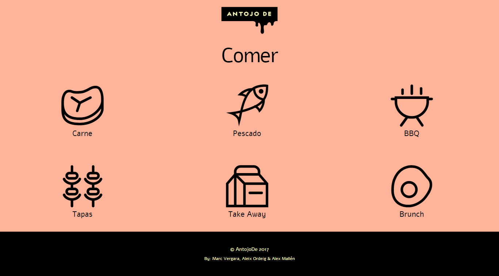

 
 

## [Antojo de! Mobile App](https://amallen22.github.io/antojode)

This repository contains a Mobile App build with HTML, SASS and Angular at [Skylab Coders Academy](http://www.skylabcoders.com/es/) Full Stack Web Development Bootcamp.

[Antojo de!](https://amallen22.github.io/antojode) use the [Foursquare API](https://developer.foursquare.com/) to search for a restaurant or a type of restaurant in your own location. All results will be shown indicating the name of the restaurant, the address and the type of restaurant to which it belongs.

---

### Getting Started

This is a set of directives and services for AngularJS `1.6.5`

### Dependencies

The following dependencies where use to make the Web application

- `AngularJS 1.6.5`

- `AngularJS route 1.6.5`

- `ngMap | AngularJS directives for google maps`

- `ngRoute | AngularJS directives`

---

### Authors:

- [Álex Mallén](https://github.com/amallen22)
- [Aleix Ordeig](https://github.com/aleixordeig)
- [Marc Vergara](https://github.com/femave)

---

### Acknowledgments

* [Simon Garmendia](https://github.com/sgarmendia)
* [Mario Terron](https://github.com/MarioTerron)
* [Alejandro DG](https://github.com/agandia9)
* [JuanMa Garrido](https://github.com/juanmaguitar)
* [Foursquare](https://es.foursquare.com/)
